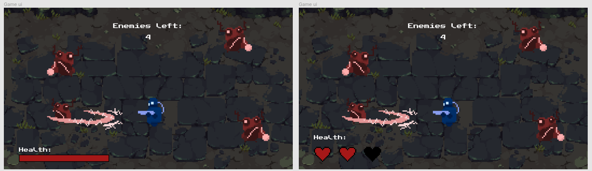
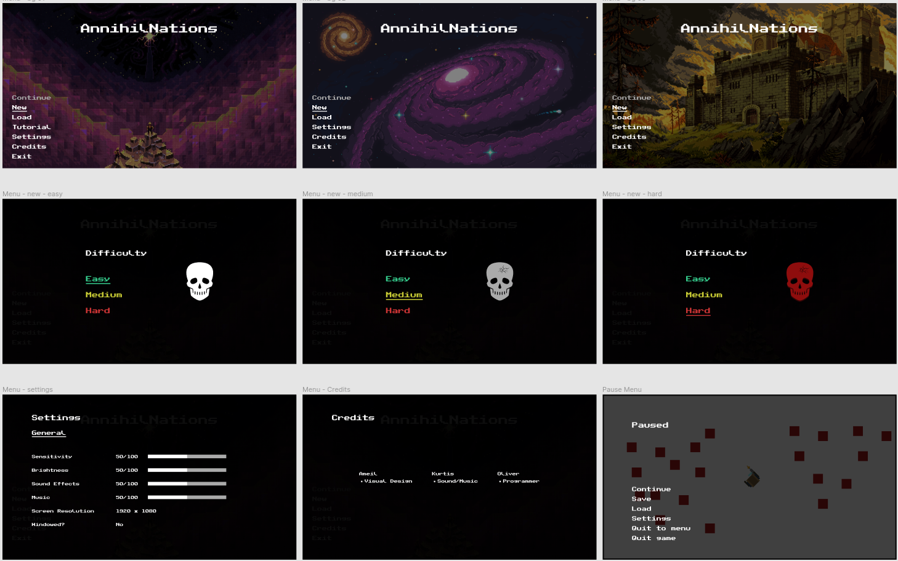
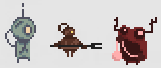
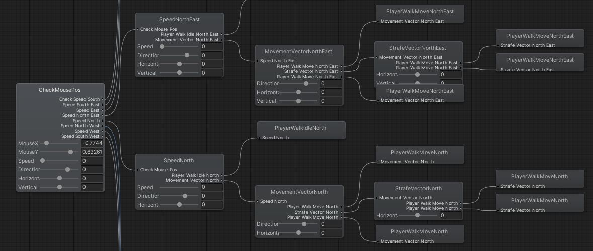
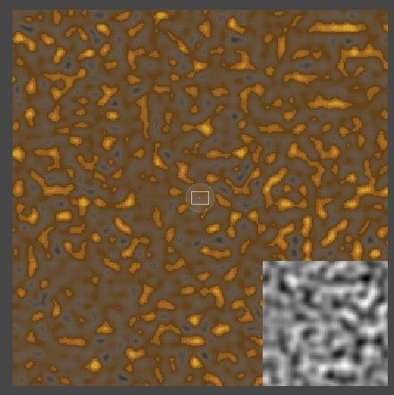

# AnnihilNations

## Contents

- [AnnihilNations](#annihilnations)
  - [Contents](#contents)
  - [Introduction](#introduction)
  - [Story](#story)
  - [Hook](#hook)
  - [Gameplay Mechanics](#gameplay-mechanics)
    - [Base Building Mechanic](#base-building-mechanic)
    - [Bullet Hell Mechanic](#bullet-hell-mechanic)
    - [Tower Defence Mechanic](#tower-defence-mechanic)
  - [Target Market](#target-market)
  - [Development](#development)
    - [Team](#team)
    - [Game Overlay](#game-overlay)
    - [Menus](#menus)
    - [Music](#music)
    - [Sound Effects](#sound-effects)
    - [Sprites](#sprites)
    - [Animations](#animations)
    - [AI](#ai)
    - [World](#world)

## Introduction

This is the main documentation for the game AnnihilNations. For additional documentation, check the [GitHub docs.](https://github.com/oliverschweikert/AnnihilNations/tree/master/docs)

To summarise the game in a sentence: AnnihilNations is a base building, bullet hell, tower defence game set in a demonic post-apocalyptic world.

Currently, the game is in it's alpha development stage, meaning some features mentioned have yet to be implemented. All features are also subject to change upon the final release.

## Story

The premise for the game is that the player is trying to survive the aftermath of an apocalyptic event - it turns out that the demon realm is a real thing, and numerous monstrosities have spilled out from their dimension to our own, wreaking havoc upon the denizens of planet earth! Our story begins a couple of years after the invasion. Resources on earth are scarce to the point that life is unsustainable, but some creative individuals have learned to harvest the invading demons for anything useful. Using these demonic materials, they attempt to eke out a living in an otherwise inhospitable planet.

## Hook

The hook, our unique selling point, is that you **want** the enemies to attack you. Basically you have to summon monstrosities in order to get all the items required for survival, such as food, water, shelter... even companionship! The mechanic that facilitates this is the concept of "bait" - you place a piece of bait and monsters will come running. There are numerous kinds of bait, each one associated with a particular monster. Since each monster has it's own strengths, weaknesses, and drops, you have to make a decision about which kind of monster you want to summon, keeping in mind the defences you have currently, and the materials you should be harvesting to progress.

## Gameplay Mechanics

As mentioned earlier, there are 3 main mechanics within AnnihilNations - base building, bullet hell, tower defence.

### Base Building Mechanic

First, lets talk about the base building mechanic, specifically base building with logistics such as resource management and production lines. There are three main kinds of logistic concepts at this stage - production buildings, processing buildings, and item transport.

Production buildings will have no inputs and be able to output materials. It is designed as a secondary method to gain some basic resources, but is still not a replacement for using bait for higher tier resources. The current design aesthetic for these buildings are breeding pens that house demons and generate resources based on the quality of the breeding pen and the number of captured demons.

Processing buildings have inputs and outputs associated with them - basically, they will take some materials as input and process them to produce different materials. Again, to encourage calling in enemy waves, these processed materials will not be a replacement for harvesting the resources from attack waves, but is simply an option to convert materials to other materials of the same tier, with some loss. This is to provide a diverse range of materials from even a single monster type, as long as the player has the appropriate infrastructure. Processing buildings can also be used to convert materials to items that can be utilised by the player and other buildings, such as ammunition.

Transport is moving materials and items around the base to where they need to be. Currently, the aesthetic for the item transport is going to be trained demons that carry items from one place to another.

### Bullet Hell Mechanic

Next, the bullet hell mechanic. This is fairly standard - when the attack waves are summoned, there will be a lot of enemies that will try to attack the player character, and the player will need quick reflexes to be able to avoid them all while fighting back at the same time. It is important to dodge all the bullets because if the player character dies, the game is over.

To help the player with this goal, there will be various items that can be produced that will provide different effects and abilities. Choosing the correct set of gear to use will depend on the playstyle of the player, and the kind of monster that the player is summoning, since each piece of gear will have different strengths and weaknesses against the various demons.

### Tower Defence Mechanic

Lastly, the tower defence mechanic. As mentioned earlier, bait is used to attract enemies, and these enemies will use a shortest path algorithm to try and retrieve the bait while laying waste to anything in their path. Becoming familiar with how the enemies decide where to walk is important to make efficient defences, because you don't need to waste precious materials building defences where the enemies are never going to walk.

With regards to the kinds of buildings that are used for the tower defence mechanic, there will be 3 main types - offensive, defensive, and utility. Each building will have different strengths and weaknesses, which should be taken into account when choosing what enemies to summon.

Offensive buildings will be various kinds of turrets that each take different kinds of ammunition, and have different attack patterns.

Defensive buildings will be things like walls and shields - they will stop enemy attacks from getting through.

Utility buildings will provide extra benefit to buildings within it's area of influence. Examples would be a healing building that repairs damages buildings, or a building that increases the DPS of nearby turrets by increasing damage or attack speed.

## Target Market

Our game is targeted toward a more hardcore gamer audience. While casual gamers would be able to play the earlier levels, they will probably find it hard to progress in later levels. This is because the rarer materials required to improve your equipment, build advanced structures, and unlock end-game technologies will be locked behind high-tier demons... and these demons will require an efficient base defence as a minimum, and a well-equipped player that can dish out constant DPS without getting hit in return is recommended.

## Development

Currently, we are at the alpha stage of development. This means that not all game features mentioned above haven't been implemented yet. As a development decision for this release, we opted to focus heavily on the bullet hell mechanic, and as such there is little to no development that has been completed on the tower defence or base building mechanics at this stage.

### Team

The AnnihilNations team is currently made up of three members - Oliver Schweikert, Ameil Burke, and Kurtis Denning.

Oliver is the project manager, and the primary developer. This means he is in charge of managing the other team members and developing the majority of the scripts within AnnihilNations.

Ameil is the chief visual designer and creator. His responsibilities were designing all the user interfaces inside of AnnihilNations, including all the menus. He was also in charge of creating or sourcing all sprites used in the game, and creating sprite sheets if the sprite was to be animated.

Kurtis is the lead sound engineer, quality assurance expert. His responsibilities were creating, sourcing, and editing all audio used within AnnihilNations, as well as ensuring that the game was actually bug-free and fun to play for the player. As the player advocate, Kurtis also produced a game trailer to promote the game in order to increase interest and get more feedback.

### Game Overlay

To design the in-game overlay, we considered what information was important to the player and what information was redundant. Because we were implementing the bullet hell aspect of the game, we didn't want to have a cluttered user interface because it would make it harder to see where the bullets were coming from, and therefore there wouldn't be enough time to react.  [Figma](https://www.figma.com/file/Wd5L0kYUTJRSKH8ZPH9oBW/Designs?node-id=0%3A1) was used to design the game overlay.

When implementing the initial overlay, we used a bar to represent the health of the player. After some consideration though, we opted to use hearts to represent remaining life. The reasons for this was because it was more aesthetically in-line with our game, and because it made it quicker to calculate how many lives you had left, as opposed to looking at a bar and trying to figure out how many lives were left from the length.

Above is an image showing the two overlay designs that we had. For clarity, we opted to go for the second one with hearts

### Menus

When designing the menus, a standard design was used. This is because menu's are primarily used to allow the player to navigate to different places within the game. Using a design that is familiar will provide a positive experience for the player, as they can easily get to where they want to be.  Just like the game overlay,  [Figma](https://www.figma.com/file/Wd5L0kYUTJRSKH8ZPH9oBW/Designs?node-id=0%3A1) was used the design the various menu's throughout the game.

To implement the menu, standard UI elements were used on a Unity canvas to design the interface. To make the menu feel more 'alive', and evoke emotions from the player, we opted to use background music and dynamic backgrounds in all menus except for the 'Pause' menu.

Above it an image showing our initial menu designs. If you compare them to the final product, you will see that they have changed a little bit.

### Music

Music is very important for setting the mood for the game. As such, the music that we have chosen is meant to evoke feelings from the player similar to if you were one of the last people left alive on Earth, and were struggling to survive against waves of monsters.

We would have liked to heavily modify the music or even created the music from scratch with software like [FL Studios](https://www.flstudio.com.au/) but due to its expense and complexity it was scrapped for simple sound manipulation with [Audacity](https://www.audacityteam.org/).

Due to the limitations mentioned above we decided to source all of our music entirely from [SoundCloud](https://soundcloud.com). Though most music found on SoundCloud isn't royalty free, we searched extra hard for some that was. This means that we can can use the music even in a release version of our game if we desire. Unfortunately due to this, not all of the music that was found was to our liking so this is where [Audacity](https://www.audacityteam.org/) comes in, allowing easy modification of the music to better suit our needs.

### Sound Effects

Sound effects are used to create a feedback loop with the player. Having a sound effect as a response to player input is a good way to let the player know they have successfully interacted with the game. It also makes the game feel more alive, as it feels like things are happening.

For this reason, it was important to use sound effects all throughout the game. This meant inside the menus as well as inside the game - providing feedback when a button is clicked is just as important as providing feedback when the player takes damage or shoots a bullet.

All of the sound effects were sourced from [MixKit](https://mixkit.co/) as the ones we were able to find were 100% royalty free which means that it could even be used in a release version of our game.

### Sprites

Sprites are all the image assets that are used in the game. To make animations, multiple sprites need to be combined together into a sprite sheet. Currently, the two main sprites that exist within AnnihilNations are the enemy sprite and the player sprite. Both of these have large sprite sheets for all the animations that they need to do.

All the sprites are made using [Piskel](https://www.piskelapp.com), a free pixel art sprite editor. This made it super easy to both create the initial sprite design, and the subsequent animated sprites, as it automatically exported the created sprites as a sprite sheet that can be directly used in Unity.

To start with, we had a couple of enemy sprite designs, but due to the amount of time it took to create the necessary animations for a single enemy, we are leaving those enemies for future releases.

Above show the different sprites that we had to start with, before we realised the time it took to animate one completely.

### Animations

Animation for the sprites was accomplished using the built-in animator controller in Unity. For both the player and enemy sprites, because the animation playing needed to be changed based on the direction of movement and the direction of the cursor from the player, two dimensional blend trees were used quite often to figure out which animation should be playing.

For many of the fade in and fade out effects present in AnnihilNations, we decided to use CoRoutines rather than an animation controller. This is because it was often easier to implement the simple animations that didn't require blend trees with scripts, rather than use the animation controller.

Originally, we weren't using mouse controls to aim, and so the animation was just based on the movement vector, and not the look vector. However, this didn't feel right when playing the game, and so we changed to using the mouse to aim, and therefore had to change the way the animations were played.

Above is an image showing a snippet of the blend tree used to animate the player.

### AI

The current AI is AnnihilNations has two main activities - reposition and shoot. To make the enemy feel more dynamic and alive, a cooldown time was placed on their shots, and during this time the enemy will reposition themselves around the player. This both makes them harder to hit, as well as making them attack from a different direction.

Because there is currently no obstacles within the game, developing this AI was quite simple, as no pathfinding algorithm was required to locate the player, nor was a raycast required to see if there was an obstacle in the way before shooting.

### World

The world within AnnihilNations is procedurally generated using a Perlin noise function to create the biomes. This ensures that there will be a gradual blend between the different biomes, so that it doesn't look too random despite having a randomly generated map.

Because the world is procedurally generated from an algorithm, it is quite easy to make the world an infinite size. However, because it would be quite memory intensive to keep a very large world loaded in memory, we also used chunk loading to only load an area immediately around the players current coordinates.

We were previously debating whether the world should be a limited size, and make it more of an 'arena' type game, but decided against the arena because in future releases we would like to add in more randomly generated objects that would make an infinite world fun to explore.

The image above shows an example of the chunks loaded around the player. In the bottom right is an example of the Perlin noise that is generated before adding color.
